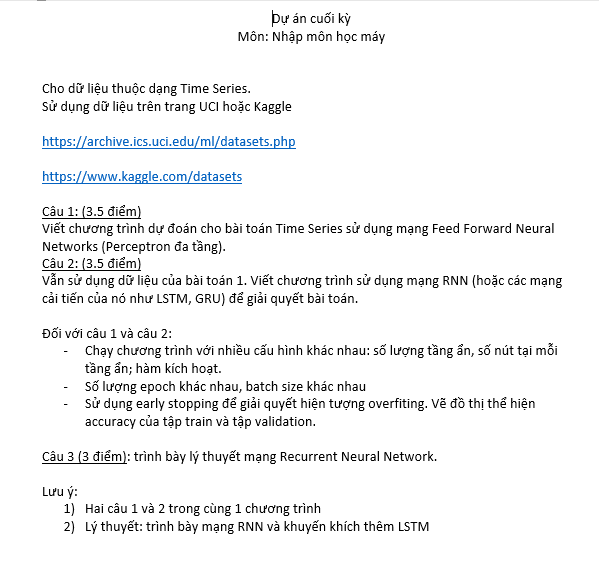

- Folder occupancy_data: chứa datasets, có thể download từ đường link trong tập tin final_ML_Occupancy.ipynb
- File final_ML_Occupancy.ipynb: Toàn bộ source code giải quyết đề tài
- File RNN-LSTM-theory.docx: Trình bày lý thuyết tìm hiểu về RNN và LSTM
- File RNN-LSTM-presentation.pptx: Trình bày lý thuyết bằng powerpoint
- Link Google Colab của source code: https://colab.research.google.com/drive/1MgAODv_OovEkrHsNuoZ9mGNeFtMHAgNz?usp=sharing

